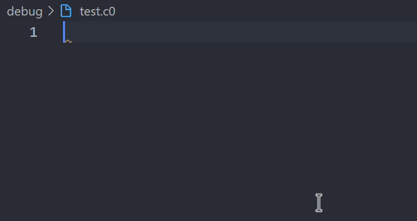

# Functionality
Adds autocomplete snippets to the C0 language.

Supported snippets include:
- Variable declarations
- Array declarations
- for- & while-loops
- Function definitions (including main)
- use-imports of libraries and files

# Showcase

# Contributors
Elias Ball & David Grawe